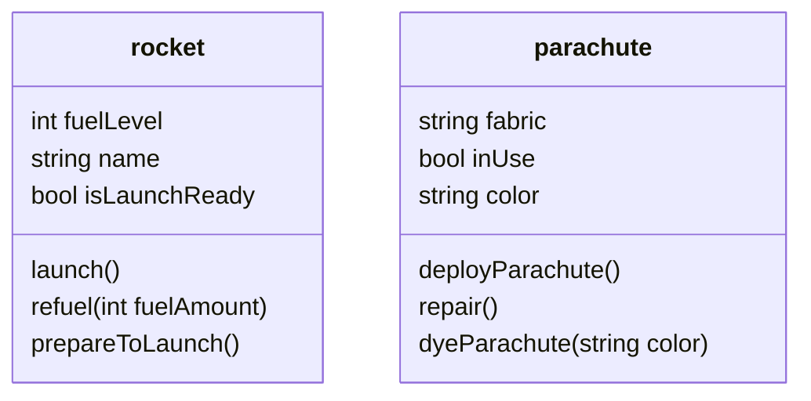

# UML Diagram for UAT Space Program

```mermaid
    classDiagram

    class rocket{
        int fuelLevel
        string name
        bool isLaunchReady
        launch()
        refuel(int fuelAmount)
        prepareToLaunch()
    }
    class parachute{
        string fabric
        bool inUse
        string color
        deployParachute()
        repair()
        dyeParachute(string color)

    }

```
